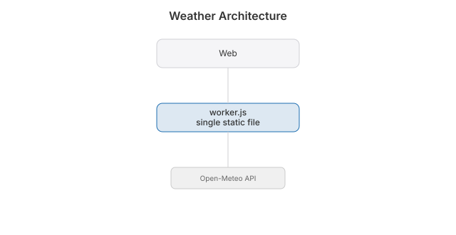

# Weather

  [](https://github.com/nulljosh/weather)

The forecast, and nothing else.

Type a city or use your location. You get the temperature now, what it feels like, and the week ahead. No account, no ads, no app to install.

**[weather.heyitsmejosh.com →](https://weather.heyitsmejosh.com)**

## Features

- **Any city.** Search by name, or one tap for where you are.
- **Seven days.** Highs, lows, conditions.
- **Celsius or Fahrenheit.** Your pick is remembered.
- **Light and dark.** Follows your system theme.

## Platforms

| | |
|---|---|
| Web | This repo, deployed to Cloudflare Workers |

## Running locally

```bash
npx wrangler dev
```

## Deploying

```bash
npx wrangler deploy
```

## Architecture


